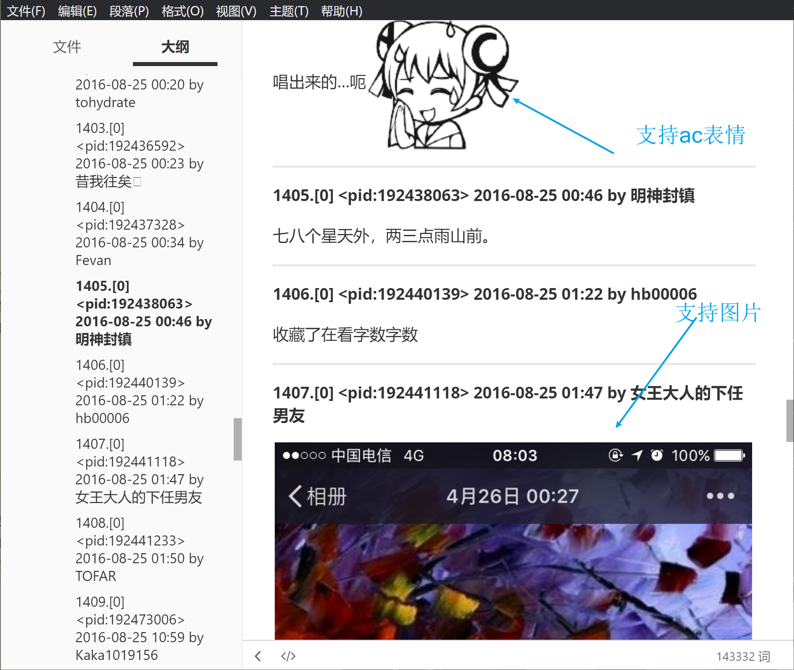

# ngapost2md

快速爬楼存回复人+时间+内容，支持保存正文内的（最高清的）图片（仅附件的图但没有附在正文内的暂时不支持）。

支持增量爬楼，支持引用内容的识别（格式可能还有问题），和 ~~（部分）ac娘表情的转义（需要到release页面下[smile.zip](https://github.com/ludoux/ngapost2md/releases/tag/alpha)）~~ 2020.8 后的版本 (nga.py 和 nga_format.py) 不再使用本地 smile.zip 表情包资源，**转为引用在线表情资源。这样子可以支持全部表情包**，但是 ac 娘表情就没有之前本地资源版本那么高清了。

## 使用指引

1. 把nga.py **和 nga_format.py** 下下来，修改前者代码文件内的 cookies（cookies是自己账号登录后的具体内容）

2. ~~将[smile.zip](https://github.com/ludoux/ngapost2md/releases/tag/alpha)解压，确保smile文件夹（里面就是各种ac娘表情包）和nga.py在同一个目录下~~

3. 双击启动输入 tid 即可，之后会反显爬楼爬页的情况和下图片的情况

4. 最后会在 nga.py 所在的目录下出一个新的以 tid 命名的文件夹，里面有 post.md 直接查看就行。info.txt 可以看标题和每次增量的具体信息（以及错误信息）。

### 图片快速指引

## 资瓷与不资瓷格式说明

资瓷的有：

- newline 换行
- pic 图片（会下载下来）
- smile 表情（只是引用在线资源）
- quote 回复与引用
- strikeout 删除线
- url 超链接
- align 对齐

不资瓷并且常出现的有：

- 字体颜色啊大小之类的格式
- 表格之类的复杂排版
- 折叠

## TODO
1. 匿名的显示处理一下，按 js 的逻辑走。
2. 引用和回复判断一下后面换行够不够。