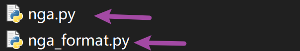
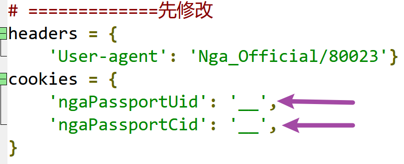
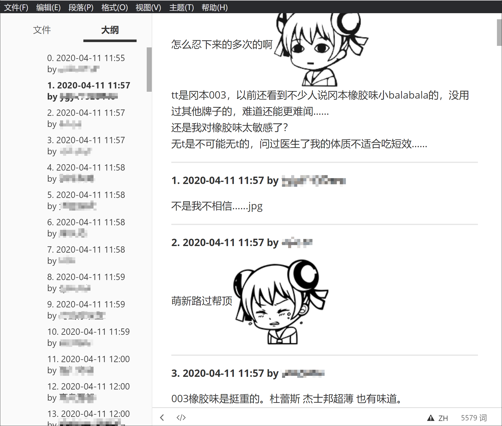
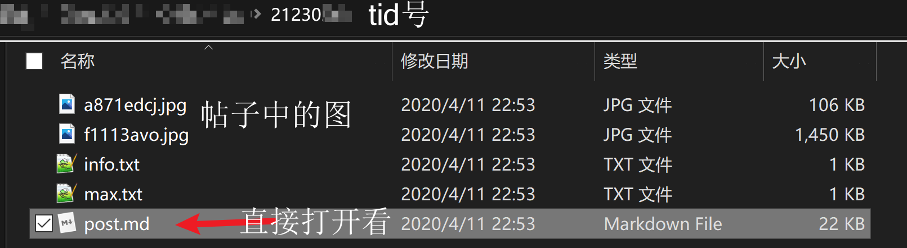

# ngapost2md

快速爬楼存回复人+时间+内容，支持保存正文内的（最高清的）图片（仅附件的图但没有附在正文内的暂时不支持）。

支持引用内容的识别（格式可能还有问题），和（部分）ac娘表情的转义（需要到release页面下smile.zip）

支持增量爬楼

## 使用指引

1. 把nga.py下下来，修改headers和cookies（cookies是自己账号登录后的具体内容）

2. 将smile.zip解压，确保smile文件夹（里面就是各种ac娘表情包）和nga.py在同一个目录下

3. 双击启动输入tid即可，之后会反显爬楼爬页的情况和下图片的情况

4. 最后会在nga.py所在的目录下出一个新的以tid命名的文件夹，里面有post.md直接查看就行。

### 图片快速指引

